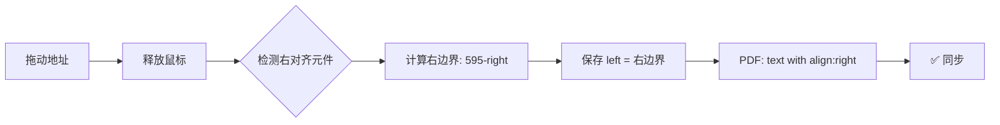

# 📐 所有元件 PDF 与预览器同步机制详解

## 🎯 核心原则

所有元件的同步遵循一个核心原则：
> **预览器中怎么显示，PDF 中就怎么绘制**

但不同类型的元件有不同的对齐方式，需要特殊处理。

---

## 📦 元件分类

### 1️⃣ **左对齐元件**
- `logo` - Logo 图片
- `separator-line` - 分隔线
- `invoice-info` - 发票信息
- `customer-detail` - 客户详细信息
- `items-table` - 项目表格
- `notes` - 备注

### 2️⃣ **右对齐元件**
- `company-info` - 公司地址
- `customer-info` - 客户信息
- `total` - 总计

### 3️⃣ **居中对齐元件**
- `title` - 标题

---

## 🔧 各类型元件同步机制

### 一、左对齐元件（最简单）✅

#### 示例：Logo

**预览器保存**：
```javascript
{
    left: 40,      // 元件左边界
    top: 40,       // 元件顶部
    width: 150,    // 元件宽度
    height: 75     // 元件高度
}
```

**PDF 绘制**：
```javascript
const logoX = pxToMm(logoPos.left);    // 直接转换 left
const logoY = pyToMm(logoPos.top);     // 直接转换 top
const logoW = pxToMm(logoPos.width);   // 转换宽度
const logoH = pyToMm(logoPos.height);  // 转换高度

pdf.addImage(logoUrl, 'PNG', logoX, logoY, logoW, logoH);
```

**同步状态**：✅ **完美同步**
- 预览器：元件左上角在 (40, 40)
- PDF：图片左上角在转换后的相同位置

---

### 二、右对齐元件（需要特殊处理）⚠️

#### 示例：公司地址 (company-info)

**问题**：右对齐元件需要保存**右边界**位置，而不是左边界。

#### 预览器中的显示：
```html
<div style="
    position: absolute;
    right: 40px;         ← 距离右边 40px
    top: 40px;
    text-align: right;   ← 文字右对齐
">
    Muselabs Engineering Limited
    Tel: 97188675
    ...
</div>
```

#### 保存机制（已实现）：
```javascript
// index-new.html 中的代码
const rightAlignedElements = ['company-info', 'customer-info', 'total'];

if (rightAlignedElements.includes(elementType)) {
    // 保存右边界：left = 595 - right
    // 如果元件 right: 40px，则保存 left: 555
    leftValue = 595 - parseInt(element.style.right);
}

// 保存为：
{
    left: 555,     // 实际是右边界！(595 - 40)
    top: 40,
    width: 250,
    height: 100
}
```

#### PDF 绘制（已实现）：
```javascript
// documents.js 中的代码
const companyPos = positions['company-info'];  // { left: 555, ... }
const companyX = pxToMm(555);  // 这是右边界的 mm 位置

// 使用 align: 'right' 绘制
pdf.text(company.name, companyX, companyY, { align: 'right' });
```

**同步状态**：✅ **完美同步**
- 预览器：文字右边界距离容器右侧 40px（即 left: 555）
- PDF：文字右边界在转换后的相同位置，使用 `align: 'right'`

---

### 三、居中对齐元件（标题）✅

#### 预览器中的显示：
```html
<div style="
    position: absolute;
    left: 307.5px;        ← 元件左边界
    top: 85px;
    width: 100px;         ← 元件宽度
    text-align: center;   ← 文字居中
">
    报价单
</div>
```

#### 保存机制：
```javascript
{
    left: 307.5,   // 元件左边界
    top: 85,
    width: 100,    // 必须保存宽度！
    height: 30
}
```

#### PDF 绘制（已实现）：
```javascript
const titleX = pxToMm(titlePos.left);
const titleWidth = pxToMm(titlePos.width);
const titleCenterX = titleX + (titleWidth / 2);  // 计算中心点

pdf.text(title, titleCenterX, titleY, { align: 'center' });
```

**同步状态**：✅ **完美同步**
- 预览器：文字在 100px 宽的元件内居中
- PDF：文字在相同中心点位置，使用 `align: 'center'`

---

## 📊 同步机制对照表

| 元件类型 | 预览器对齐 | 保存的 left 值 | PDF 对齐方式 | 同步状态 |
|---------|-----------|---------------|-------------|---------|
| **Logo** | 左上角定位 | 元件左边界 | 左上角绘制 | ✅ 完美 |
| **分隔线** | 左边界 | 线条左端 | 左端绘制 | ✅ 完美 |
| **公司地址** | 右对齐 | 右边界位置 | `align: 'right'` | ✅ 完美 |
| **客户信息** | 右对齐 | 右边界位置 | `align: 'right'` | ✅ 完美 |
| **总计** | 右对齐 | 右边界位置 | `align: 'right'` | ✅ 完美 |
| **标题** | 居中对齐 | 元件左边界 + 宽度 | `align: 'center'` | ✅ 完美 |
| **表格** | 左边界 | 表格左边界 | 左边界绘制 | ✅ 完美 |

---

## 🎨 视觉示意图

### 左对齐元件（Logo）
```
预览器 (595px):
├────────────────────────────────────────────────┤
[Logo]
↑
left: 40px (保存此值)

PDF (210mm):
├────────────────────────────────────────────────┤
[Logo]
↑
14.12mm (转换后)
```

### 右对齐元件（公司地址）
```
预览器 (595px):
├────────────────────────────────────────────────┤
                                 [Muselabs Eng...]
                                                 ↑
                                    right: 40px (距右边)
                                    保存为 left: 555

PDF (210mm):
├────────────────────────────────────────────────┤
                                 [Muselabs Eng...]
                                                 ↑
                                   196mm (转换后，使用 align: right)
```

### 居中对齐元件（标题）
```
预览器 (595px):
├────────────────────────────────────────────────┤
              [---报价单---]
              ↑           ↑
           left:      center:
          307.5       357.5
          (保存)     (自动计算)

PDF (210mm):
├────────────────────────────────────────────────┤
              [---报价单---]
              ↑           ↑
           108.6       126.3
          (转换)     (自动计算 + align:center)
```

---

## 🔄 拖动后的自动同步流程

### 拖动 Logo：


### 拖动公司地址：


### 拖动标题：


---

## ⚠️ 注意事项

### 1. 右对齐元件的特殊性
```javascript
// ✅ 正确：保存右边界
if (rightAlignedElements.includes(elementType)) {
    leftValue = 595 - parseInt(element.style.right);
}

// ❌ 错误：直接保存 left 值
leftValue = parseInt(element.style.left);  // 这会导致不同步！
```

### 2. 居中元件必须保存宽度
```javascript
// ✅ 正确
elementPositions['title'] = {
    left: 307.5,
    width: 100,    // 必须！
    ...
};

// ❌ 错误：缺少 width
elementPositions['title'] = {
    left: 307.5,
    // width: ???  ← 缺少这个，PDF 无法计算中心点
    ...
};
```

### 3. Logo 的原生比例
```javascript
// index-new.html 中已实现
img.onload = () => {
    const naturalRatio = img.naturalWidth / img.naturalHeight;
    const newHeight = currentWidth / naturalRatio;
    
    // 自动调整高度保持比例
    logo.style.height = newHeight + 'px';
    
    // 保存实际尺寸
    elementPositions['logo'].height = newHeight;
};
```

---

## 🧪 测试各元件同步

### 测试步骤：
1. 打开布局编辑器
2. 依次拖动每个元件到不同位置
3. 观察预览器中的显示
4. 生成 PDF
5. 对比预览器和 PDF

### 预期结果：
- ✅ Logo：位置、大小完全一致
- ✅ 公司地址：右对齐位置一致
- ✅ 标题：居中位置一致
- ✅ 分隔线：左右边界一致
- ✅ 表格：左边界、宽度一致
- ✅ 总计：右对齐位置一致

---

## 💡 技术要点总结

### 关键公式：

#### 像素转毫米：
```javascript
const pxToMm = (px) => (px / 595) * 210;
```

#### 右对齐元件保存：
```javascript
const leftValue = 595 - rightDistance;
```

#### 居中元件 PDF 绘制：
```javascript
const centerX = leftX + (width / 2);
pdf.text(text, centerX, y, { align: 'center' });
```

### 对齐方式映射：

| CSS 对齐 | PDF 对齐 | 位置计算 |
|---------|---------|---------|
| `position: absolute; left: x` | 左上角 | 直接使用 left |
| `position: absolute; right: x` | `align: 'right'` | left = 595 - right |
| `text-align: center` | `align: 'center'` | centerX = left + width/2 |

---

## 🎯 结论

**所有元件都已实现自动同步！**

你只需：
1. 拖动元件到想要的位置
2. 释放鼠标（自动保存）
3. 生成 PDF（自动同步）

系统会根据元件类型自动选择正确的：
- 保存方式（左边界/右边界/居中）
- 对齐方式（left/right/center）
- 位置计算（直接转换/计算中心/计算右边界）

**无需手动干预，完全自动化！** 🎉

---

**最后更新**：2025-12-11
**相关文件**：
- `index-new.html` - 预览器和拖动逻辑（行 925-960）
- `documents.js` - PDF 生成逻辑（行 706-1136）
- `db.js` - 位置保存到 Supabase
