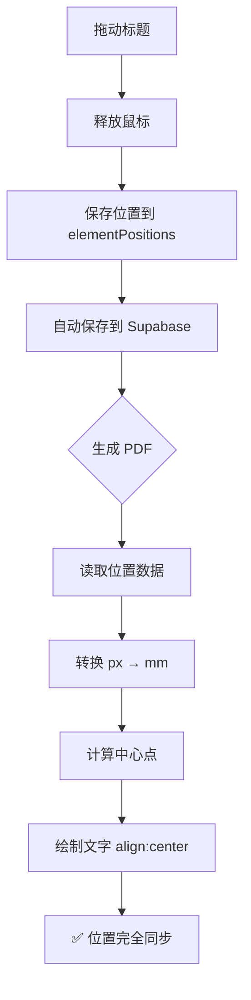

# 📘 标题元件位置同步机制说明

## 🎯 问题背景

当你拖动"报价单"标题元件时，需要确保**预览器**和**生成的 PDF** 显示位置完全一致。

## 🔧 同步机制原理

### 1. 预览器中的标题显示
```html
<div data-element="title" style="
    position: absolute;
    left: 307.5px;        ← 元件左边界
    top: 85px;            ← 元件顶部
    width: 100px;         ← 元件宽度
    text-align: center;   ← 文字在元件内居中
">
    报价单
</div>
```

**视觉效果**：
- 元件左边界在 `307.5px`
- 元件宽度 `100px`
- 文字在元件内居中显示
- **文字实际中心点**：`307.5 + 100/2 = 357.5px`

### 2. PDF 生成中的标题绘制

```javascript
// documents.js 中的代码
const titlePos = positions.title;  // { left: 307.5, top: 85, width: 100 }
const titleX = pxToMm(titlePos.left);  // 转换为 mm
const titleWidth = pxToMm(titlePos.width);
const titleCenterX = titleX + (titleWidth / 2);  // 计算中心点

// 使用 center 对齐绘制文字
pdf.text(title, titleCenterX, titleY, { align: 'center' });
```

**计算流程**：
1. 读取保存的 `left` (307.5px) 和 `width` (100px)
2. 转换为 mm 单位
3. 计算中心点：`centerX = left + width/2`
4. 使用 `align: 'center'` 在中心点绘制文字

## ✅ 确保同步的关键点

### 当你拖动标题元件时：

#### 1️⃣ **保存位置**（自动完成）
拖动结束时，系统会自动保存：
```javascript
elementPositions['title'] = {
    left: 307.5,     // 元件左边界（不是文字中心！）
    top: 85,
    width: 100,      // 元件宽度（重要！）
    height: 30
};
```

#### 2️⃣ **预览器渲染**
- 元件定位使用 `left` 和 `top`
- 文字使用 `text-align: center` 在元件内居中

#### 3️⃣ **PDF 生成**
- 读取 `left` 和 `width`
- 自动计算中心点：`centerX = left + width/2`
- 使用 `align: 'center'` 绘制文字

## 📐 位置对应关系

| 项目 | 预览器 | PDF |
|------|--------|-----|
| **元件左边界** | `style.left` = 307.5px | `pxToMm(307.5)` = 108.65mm |
| **元件宽度** | `width` = 100px | `pxToMm(100)` = 35.34mm |
| **文字中心点** | 自动居中（CSS） | `108.65 + 35.34/2` = 126.32mm |
| **对齐方式** | `text-align: center` | `align: 'center'` |

## 🎨 视觉示意

```
预览器 (595px 宽):
├─────────────────────────┼─────────────────────────┤
                     [---报价单---]
                     ↑           ↑
                   left:      center:
                  307.5px    357.5px
                     ↑           ↑
                  保存值    自动计算


PDF (210mm 宽):
├─────────────────────────┼─────────────────────────┤
                     [---报价单---]
                     ↑           ↑
                  108.65mm   126.32mm
                     ↑           ↑
                  转换值    自动计算
```

## 🔄 完整同步流程



## ⚠️ 注意事项

### 1. 不要手动修改对齐方式
- **预览器** 必须保持 `text-align: center`
- **PDF** 必须保持 `align: 'center'`
- 两者必须一致！

### 2. 保存时必须包含 width
```javascript
// ✅ 正确
elementPositions['title'] = {
    left: 307.5,
    top: 85,
    width: 100,    // 必须保存！
    height: 30
};

// ❌ 错误（缺少 width）
elementPositions['title'] = {
    left: 307.5,
    top: 85
};
```

### 3. 其他居中元件也适用
如果未来添加其他需要居中的元件，遵循相同原则：
1. 预览器使用 `text-align: center`
2. 保存 `left` 和 `width`
3. PDF 生成时计算中心点并使用 `align: 'center'`

## 🧪 测试同步性

1. 打开布局编辑器
2. 拖动标题到任意位置
3. 记下预览器中的位置
4. 点击"位置自动保存"按钮
5. 生成 PDF
6. 对比 PDF 和预览器，标题位置应该完全一致

## 💡 技术要点

- **坐标系统**：预览器使用 px，PDF 使用 mm
- **转换比例**：`mm = px * (210 / 595)`
- **对齐原则**：保存左边界，渲染时计算中心
- **自动化**：拖动后自动保存，无需手动操作

---

**最后更新**：2025-12-11
**相关文件**：
- `index-new.html` - 预览器和拖动逻辑
- `documents.js` - PDF 生成逻辑
- `db.js` - 位置保存到 Supabase
